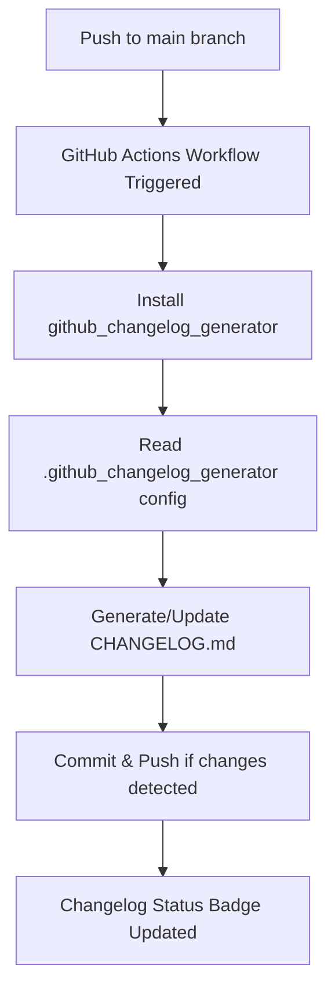

# Seatek Analysis (R-Tier)

[](https://github.com/abhimehro/Seatek_Analysis/actions/workflows/codeql.yml)
[](https://rstudio.github.io/renv/)
[](https://github.com/abhimehro/Seatek_Analysis/actions/workflows/changelog.yml)

---

## Project Overview

This repository contains the R-based analysis tier for processing Seatek sensor data and generating Excel workbooks. It is part of a three-tier analysis system:

1. **R-Tier (This Repository):** Ingests, validates, and processes raw Seatek sensor data (`S28_Yxx.txt`), exports cleaned data and summary metrics (first 10, last 5, full, and within_diff for each sensor) to Excel, and generates a combined summary workbook. Robust logging and error handling are included.
2. **Excel-Tier:** Manages intermediate data processing and basic visualizations.
3. **Python-Tier:** Handles advanced data visualization and large-scale data processing.

---

## Repository Structure

```Markdown
├── Data/
│   ├── Series_26/              # Series 26 sensor data and analysis
│   ├── Series_27/              # Series 27 sensor data and analysis
│   ├── Raw_Data_*.xlsx         # Raw data files by year (auto-generated)
│   ├── S26_*.txt / S28_*.txt   # Raw sensor text files (Series 26/28)
│   └── *_Data.xlsx             # Processed data workbooks (auto-generated)
├── Seatek_Analysis.R           # Main analysis script (entry point)
├── Updated_Seatek_Analysis.R   # Alternate/newer analysis script
├── requirements.R              # R package requirements and setup
├── seatek_analysis.log         # Log file for analysis runs
├── processing_log.txt          # Detailed processing log
├── analysis_report_log.txt     # Analysis report generation log
├── Seatek_Analysis.Rproj       # R project configuration
├── .github_changelog_generator # Changelog config (see below)
└── README.md                   # Project documentation
```

---

## Visual Summary: Automated Changelog Workflow

Below is a high-level diagram of the changelog automation process, designed for clarity and reproducibility in collaborative research environments:



**How it works:**  
- Every push to `main` triggers the changelog workflow.
- The workflow installs dependencies, reads your changelog config, and generates or updates `CHANGELOG.md`.
- If there are changes, it commits and pushes them back to the repository.
- The [Changelog Status badge](https://github.com/abhimehro/Seatek_Analysis/actions/workflows/changelog.yml) at the top of this README reflects the latest workflow run.

(Checkpoint: This step involves continuous integration and automated documentation, which are foundational for reproducible research and collaborative data science.)

---

## Changelog Automation

This project uses [github_changelog_generator](https://github.com/github-changelog-generator/github-changelog-generator) for automated changelog management.  
**Configuration:**  
- The changelog generator is configured via the `.github_changelog_generator` file (located in the project root or `.github/` directory).
- The changelog is automatically updated on each push to `main` via a GitHub Actions workflow.

**Label conventions:**  
To ensure your contributions are categorized correctly in the changelog, please use the following labels on issues and pull requests:

| Section             | Example Labels                | Description                                  |
|---------------------|------------------------------|----------------------------------------------|
| **Enhancements**    | `enhancement`, `type: enhancement` | New features, improvements                   |
| **Bug Fixes**       | `bug`, `type: bug`           | Fixes for errors or unexpected behavior      |
| **Breaking Changes**| `breaking`, `backwards incompatible` | Changes that may break existing workflows    |
| **Deprecated**      | `deprecated`                 | Features scheduled for removal               |
| **Removed**         | `removed`                    | Features or code that have been removed      |
| **Security**        | `security`                   | Security-related fixes or updates            |
| **Data Updates**    | `data update`, `dataset`     | Updates to datasets or data sources          |
| **Analysis**        | `analysis`, `results`        | New or updated analyses, results, or methods |
| **Documentation**   | `documentation`              | Improvements to docs, guides, or READMEs     |

*Excluded from changelog:* `duplicate`, `question`, `invalid`, `wontfix`, `Meta: Exclude From Changelog`

**Tip:**  
If you're unsure which label to use, see [CONTRIBUTING.md](./CONTRIBUTING.md) for detailed guidance.

---

## Contributing

We welcome contributions from all backgrounds!  
Please see [CONTRIBUTING.md](./CONTRIBUTING.md) for our workflow, label conventions, and best practices for reproducible, transparent research and development.

---

## Changelog

See [CHANGELOG.md](./CHANGELOG.md) for a detailed, automatically generated history of project changes.

### 2025-05-10

- README.md updated: added changelog, renv badge, troubleshooting, and clarified setup steps.
- Enhanced logging and error handling in analysis scripts.
- Added `Updated_Seatek_Analysis.R` as an alternative workflow.
- Expanded package requirements and reproducibility via `renv`.
- Improved Excel output structure and summary generation.
- Updated summary metrics: now uses first 10, last 5, full, and within_diff for each sensor in all outputs and summary sheets.
- Corrected year mapping: Y01=1995, Y20=2014 in all Excel outputs.

---

## License

Verify license compatibility before use.

---

**Checkpoint:**  
This README reflects the latest automation, changelog, and contribution practices. If you update label conventions, workflows, or project structure, please revise this document to keep it current and clear for all collaborators.

---

**Next Steps & Recommendations:**

- If you're contributing, review the [CONTRIBUTING.md](./CONTRIBUTING.md) for label usage and workflow details.
- For changelog or workflow questions, consult the `.github_changelog_generator` config or open an issue.
- Use browser-based features (e.g., highlight-to-note, integrated search) to streamline your workflow and documentation review.

## Robust Sensor Statistics and Outputs

The analysis now computes and exports robust statistics for each sensor and metric, including:

- **Mean** and **Standard Deviation (SD)**
- **Median** and **Median Absolute Deviation (MAD)**
- **3-year Rolling Mean** (where possible)

These are available in the main summary workbook and in `Data/Seatek_Summary_robust.csv`.

**Sufficient data threshold:** Sensors are included in the filtered summary if they have at least 5 valid data points.

All outputs are updated automatically as new data is added to the `Data/` directory.

These robust statistics support more reliable sensor diagnostics and anomaly detection.
