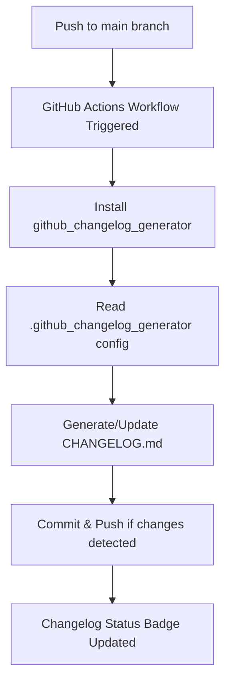

# Seatek Analysis (R-Tier)

[](https://github.com/abhimehro/Seatek_Analysis/actions/workflows/codeql.yml)
[](https://rstudio.github.io/renv/)
[](https://github.com/abhimehro/Seatek_Analysis/actions/workflows/changelog.yml)

---

## Project Overview

This repository contains the R-based analysis tier for processing Seatek sensor data and generating Excel workbooks. It is part of a three-tier analysis system:

1. **R-Tier (This Repository):** Ingests, validates, and processes raw Seatek sensor data (primarily `SS_Yxx.txt` for Series 28, and `S26_Yxx.txt` for Series 26), exports cleaned data and summary metrics (first 10, last 5, full, and within_diff for each sensor) to Excel, and generates a combined summary workbook. Robust logging and error handling are included.
2. **Excel-Tier:** Manages intermediate data processing and basic visualizations.
3. **Python-Tier:** Handles advanced data visualization and large-scale data processing.

---

## Setup

To get started with this project and ensure all dependencies are correctly installed, please run the setup script:

```bash
./setup.sh
```

This script will:
- Install system packages (R, Python, libgit2-dev, pandoc) if missing.
- Install required R packages using `renv`.
- Create a Python virtual environment (if it doesn't exist) and install required Python packages.

---

## Repository Structure

```Markdown
├── Data/                             # Primary output directory for Updated_Seatek_Analysis.R
│   ├── SS_Yxx.txt                    # Raw Series 28 data files (input for Updated_Seatek_Analysis.R, sourced from Data/ or Series_28/Raw_Data/)
│   ├── S26_Yxx.txt                   # Raw Series 26 data files (input for Updated_Seatek_Analysis.R, sourced from Series_26/Raw_Data/Text_Files/) - if processed, results are here.
│   ├── SS_Yxx.xlsx                   # Processed Series 28 data per year (output of Updated_Seatek_Analysis.R, placed in Data/)
│   ├── S26_Yxx.xlsx                  # Processed Series 26 data per year (output of Updated_Seatek_Analysis.R, placed in Data/)
│   ├── Seatek_Summary.xlsx           # Main summary Excel workbook from Updated_Seatek_Analysis.R (multi-sheet output)
│   ├── Seatek_Summary.csv            # Main summary CSV (output of Updated_Seatek_Analysis.R)
│   ├── Seatek_Summary_all.csv        # Comprehensive summary CSV (output of Updated_Seatek_Analysis.R)
│   ├── Seatek_Summary_robust.csv     # Summary with robust statistics (output of Updated_Seatek_Analysis.R)
│   ├── Seatek_Summary_sufficient.csv # Summary for sensors with sufficient data (output of Updated_Seatek_Analysis.R)
│   └── Seatek_Summary_top_sensors.csv # Summary for top sensors (output of Updated_Seatek_Analysis.R)
├── Series_26/                        # Data and analysis specific to Series 26 sensors
│   ├── Raw_Data/
│   │   ├── Text_Files/
│   │   │   └── S26_Yxx.txt           # Raw Series 26 text files (input to Updated_Seatek_Analysis.R)
│   │   └── Excel_Files/
│   │       └── Raw_Data_Year_*.xlsx  # Raw Series 26 data in Excel format (often manually curated or from other processes)
│   ├── Processed_Data/
│   │   └── Year_YYYY (Yxx)_Data.xlsx # Processed Series 26 data per year (output of older scripts or specific S26 processing)
│   └── Analysis/                     # Analysis summaries and logs for Series 26
│       ├── Seatek_Analysis_Summary.xlsx
│       ├── Seatek_Comprehensive_Analysis.xlsx
│       ├── analysis_report_log.txt
│       └── processing_log.txt
├── Series_27/                        # Data and analysis specific to Series 27 sensors
│   └── Analysis/                     # Main working directory for Series 27
│       ├── Raw_Data/                 # Raw data for Series 27 (organized by year within Text_Files/ and Excel_Files/)
│       │   ├── Text_Files/S27_Yxx.txt #(example, actual names might vary, typically not processed by Updated_Seatek_Analysis.R)
│       │   └── Excel_Files/Raw_Data_Year_*.xlsx #(example)
│       ├── Processed_Data/           # Processed data for Series 27
│       │   └── Year_YYYY (Yxx)_Data.xlsx #(example)
│       ├── outlier_analysis_series27.py # Python script for S27 outlier detection and correction
│       ├── Data_Validation_Report.xlsx
│       ├── Seatek_Analysis_Summary.xlsx
│       ├── Seatek_Comprehensive_Analysis.xlsx
│       ├── analysis_report_log.txt
│       ├── processing_log.txt
│       ├── requirements.txt          # Python requirements for outlier_analysis_series27.py
│       └── validation_log.txt
├── Series_28/                        # Data and analysis specific to Series 28 sensors (primary input for SS_Yxx files)
│   ├── Raw_Data/
│   │   └── SS_Yxx.txt                # Raw Series 28 text files (chronologically organized, primary input for Updated_Seatek_Analysis.R)
│   ├── Processed_Data/
│   │   └── SS_Yxx.xlsx               # Processed Series 28 data per year (can be an output of Updated_Seatek_Analysis.R if configured, or manual)
│   └── Analysis/                     # Summary outputs specific to Series 28 processing (often mirrors content of top-level Data/ for SS_Yxx files)
│       ├── Seatek_Summary.xlsx
│       ├── Seatek_Summary.csv
│       └── (other Seatek_Summary*.csv files like _all, _robust, _sufficient, _top_sensors)
├── Updated_Seatek_Analysis.R   # Primary R analysis script.
│                                     # Processes S26_Yxx.txt (from Series_26/Raw_Data/Text_Files/) and
│                                     # SS_Yxx.txt (from Data/ or Series_28/Raw_Data/).
│                                     # Key outputs are generated in the top-level Data/ directory:
│                                     #   - Individual year Excel files: Data/SS_Yxx.xlsx, Data/S26_Yxx.xlsx
│                                     #   - Main summary workbook: Data/Seatek_Summary.xlsx
│                                     #   - Summary CSVs: Data/Seatek_Summary.csv, Data/Seatek_Summary_all.csv,
│                                     #     Data/Seatek_Summary_robust.csv, Data/Seatek_Summary_sufficient.csv,
│                                     #     Data/Seatek_Summary_top_sensors.csv.
├── requirements.R              # R package requirements for R scripts, managed by renv (see renv.lock).
├── seatek_analysis.log         # General log file, may be used by Updated_Seatek_Analysis.R or other processes.
├── processing_log.txt          # Detailed processing log, often appended to by analysis scripts.
├── analysis_report_log.txt     # Log specific to analysis report generation.
├── Seatek_Analysis.Rproj       # RStudio Project file.
├── renv.lock                   # renv lockfile for reproducible R environment.
├── renv/                         # renv library and activation scripts.
├── .github_changelog_generator # Configuration for the changelog generator.
└── README.md                   # This file.
```

---

## Visual Summary: Automated Changelog Workflow

Below is a high-level diagram of the changelog automation process, designed for clarity and reproducibility in collaborative research environments:



**How it works:**  

- Every push to `main` triggers the changelog workflow.
- The workflow installs dependencies, reads your changelog config, and generates or updates `CHANGELOG.md`.
- If there are changes, it commits and pushes them back to the repository.
- The [Changelog Status badge](https://github.com/abhimehro/Seatek_Analysis/actions/workflows/changelog.yml) at the top of this README reflects the latest workflow run.

(Checkpoint: This step involves continuous integration and automated documentation, which are foundational for reproducible research and collaborative data science.)

---

## Changelog Automation

This project uses [github_changelog_generator](https://github.com/github-changelog-generator/github-changelog-generator) for automated changelog management.  
**Configuration:**  

- The changelog generator is configured via the `.github_changelog_generator` file (located in the project root or `.github/` directory).
- The changelog is automatically updated on each push to `main` via a GitHub Actions workflow.

**Label conventions:**  
To ensure your contributions are categorized correctly in the changelog, please use the following labels on issues and pull requests:

| Section             | Example Labels                | Description                                  |
|---------------------|------------------------------|----------------------------------------------|
| **Enhancements**    | `enhancement`, `type: enhancement` | New features, improvements                   |
| **Bug Fixes**       | `bug`, `type: bug`           | Fixes for errors or unexpected behavior      |
| **Breaking Changes**| `breaking`, `backwards incompatible` | Changes that may break existing workflows    |
| **Deprecated**      | `deprecated`                 | Features scheduled for removal               |
| **Removed**         | `removed`                    | Features or code that have been removed      |
| **Security**        | `security`                   | Security-related fixes or updates            |
| **Data Updates**    | `data update`, `dataset`     | Updates to datasets or data sources          |
| **Analysis**        | `analysis`, `results`        | New or updated analyses, results, or methods |
| **Documentation**   | `documentation`              | Improvements to docs, guides, or READMEs     |

*Excluded from changelog:* `duplicate`, `question`, `invalid`, `wontfix`, `Meta: Exclude From Changelog`

**Tip:**  
If you're unsure which label to use, see [CONTRIBUTING.md](./CONTRIBUTING.md) for detailed guidance.

---

## Contributing

We welcome contributions from all backgrounds!  
Please see [CONTRIBUTING.md](./CONTRIBUTING.md) for our workflow, label conventions, and best practices for reproducible, transparent research and development.

---

## Changelog

See [CHANGELOG.md](./CHANGELOG.md) for a detailed, automatically generated history of project changes. This file is updated automatically by a GitHub Actions workflow using `github_changelog_generator`. Refer to the "Changelog Automation" section for more details on labels and configuration.

---

## License

Verify license compatibility before use.

---

**Checkpoint:**  
This README reflects the latest automation, changelog, and contribution practices. If you update label conventions, workflows, or project structure, please revise this document to keep it current and clear for all collaborators.

---

**Next Steps & Recommendations:**

- If you're contributing, review the [CONTRIBUTING.md](./CONTRIBUTING.md) for label usage and workflow details.
- For changelog or workflow questions, consult the `.github_changelog_generator` config or open an issue.
- Use browser-based features (e.g., highlight-to-note, integrated search) to streamline your workflow and documentation review.

## Robust Sensor Statistics and Outputs

The analysis now computes and exports robust statistics for each sensor and metric, including:

- **Mean** and **Standard Deviation (SD)**
- **Median** and **Median Absolute Deviation (MAD)**
- **3-year Rolling Mean** (where possible)

These are available in the main summary workbook and in `Data/Seatek_Summary_robust.csv`.

**Sufficient data threshold:** Sensors are included in the filtered summary if they have at least 5 valid data points.

All outputs are updated automatically as new data is added to the `Data/` directory.

These robust statistics support more reliable sensor diagnostics and anomaly detection.

## Linting

This project uses `lintr` for static code analysis of R scripts. The `lintr` package is managed via `renv`.
To run the linter locally, ensure `lintr` is installed in your project environment (`renv::install("lintr")` if needed, though it should be picked up from `requirements.R` during `renv::restore()`).
You can then run the linter using:
```R
lintr::lint_dir(".")
```
The linter configuration is currently the default provided by `lintr`. Key changes during the recent linter upgrade (February 2025):
- `lintr` was added to `requirements.R` and its version (and dependencies) are now tracked in `renv.lock`.
- Several style issues (line length, spacing, brace placement, etc.) were autofixed across project R files.
- Some variable names in `Updated_Seatek_Analysis.R` (`headerStyle`, `highlightStyle`) were refactored to `header_style`, `highlight_style_yearly`, and `highlight_style_summary` for style consistency. These were internal changes to a function and are not expected to be breaking.
- `lintr` currently flags potential `object_usage_linter` warnings for the 'Timestamp' variable within `data.table` assignments. These are believed to be false positives due to `data.table`'s non-standard evaluation and have been left as is for now.
